# Spark for VK Assignments
## Task description
Clean and extract informations form VK data (a social application) (see [task_description](./BgData-Task.txt))   
Data size: 44GB  
Sample data size: 16GB  
Platform: pyspark 2.2.0 in ubuntu 16.04 LTS
## How to run
Uncomment the task functions below from [here](./vk-project):  
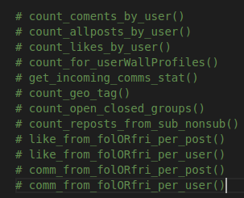  
## NOTE
Since data is pretty large, only sample result(20 rows usually) is presented. And if you wanna check full result, kindly please go run the [here](./vk-project).  
## Results for level basic
1. count of comments, posts (all), original posts, reposts and likes made by user  
sample count of comm per user  
    * COMMENTS COUNT  
    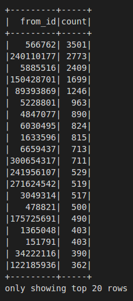  
    * ALL POSTS COUNT  
    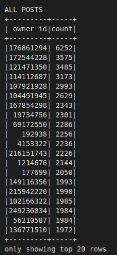
    * ORIGINAL POSTS COUNT  
    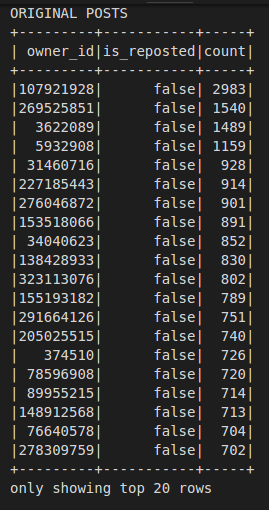  
    * REPOSTS COUNT  
    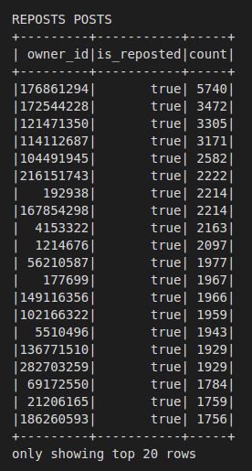  
    * LIKES COUNT  
    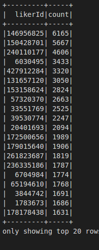  
2. count of friends, groups, followers 
3. count of videos, audios, photos, gifts
    * COMBINED COUNTS  
    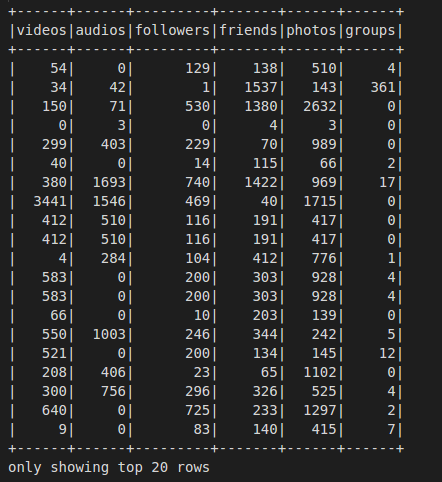  
4. count of "incoming" (made by other users) comments, max and mean "incoming" comments per post  
    * INCOMING COMMENTS STATS:  
    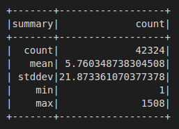  
5. count of "incoming" likes, max and mean "incoming" likes per post  
    * INCOMING LIKES  
    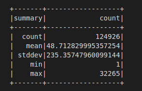 
6. count of geo tagged posts  
    * Count of geo tagged posts  
    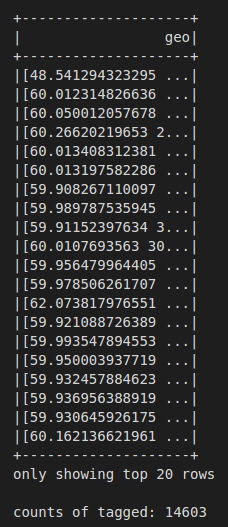
7. count of open / closed (e.g. private) groups a user participates in  
    * Count of opened closed  
    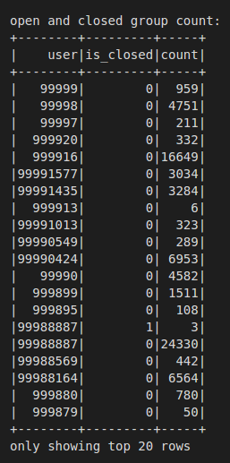

## Results for level medium
1. count of reposts from subscribed and not-subscribed groups  
    * COUNTS OF REPOSTS FROM SUB AND NONSUB GROUPS  
    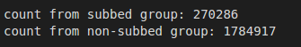 

2. TO BE ADDED
3. Aggregate (e.g. count, max, mean) characteristics for comments and likes (separtely) made by (a) friends and (b) followers per post  
    * LIKE PER POST FROM FOLLOWERS AND FRIENDS  
    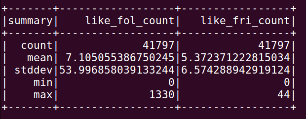  
    * COMMENTS PER POST FROM FOLLOWERS AND FRIENDS  
    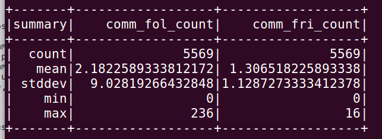  
4. Aggregate (e.g. count, max, mean) characteristics for comments and likes (separtely) made by (a) friends and (b) followers per user
    * LIKE PER USER FROM FOLLOWERS AND FRIENDS  
    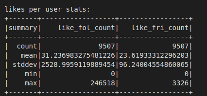  
    * COMMENTS PER POST FROM FOLLOWERS AND FRIENDS  
    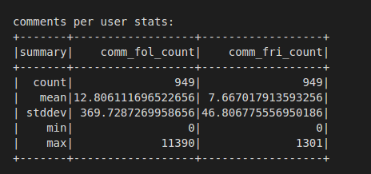
5. TO BE ADDED